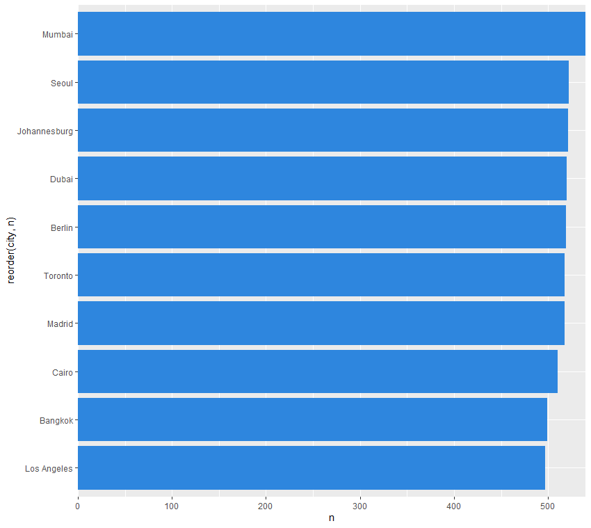
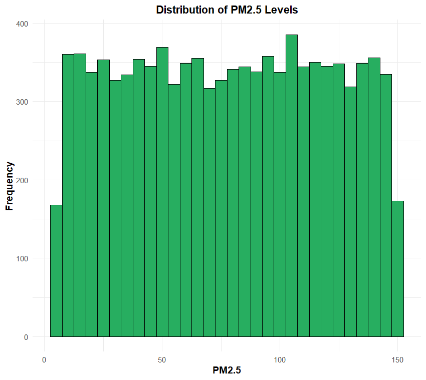
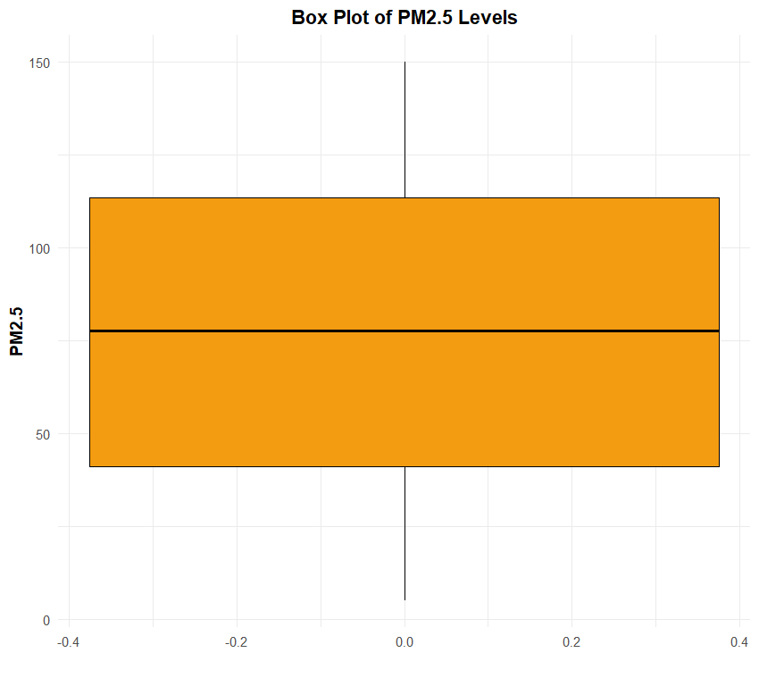
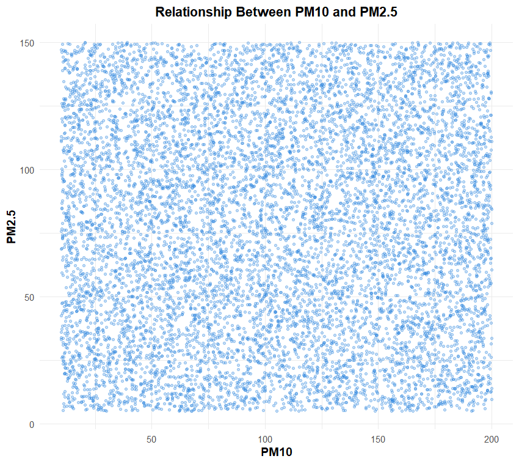
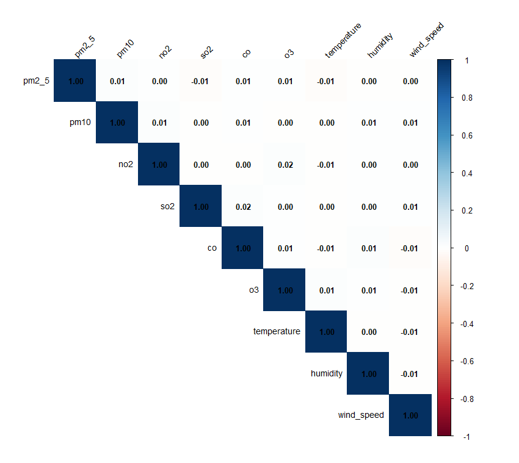
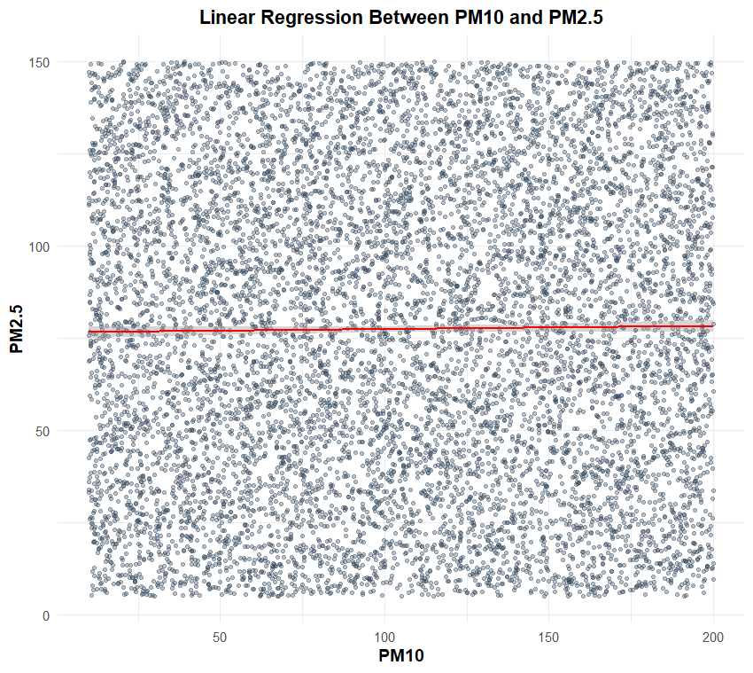

# 🌍 Global Air Quality Analysis Using R

---

# 📌 Project Overview

This project performs Exploratory Data Analysis (EDA) on a Global Air Quality dataset using R. The objective is to analyze air pollution indicators, understand relationships between environmental variables, and build regression models to study PM2.5 levels.

---

# 🎯 Objectives

- Clean and prepare the dataset
- Perform exploratory data analysis
- Visualize pollutant distributions
- Analyze correlations among variables
- Build regression models
- Draw meaningful insights from the data

---

# 🛠️ Technologies Used

- R
- tidyverse
- ggplot2
- janitor
- corrplot
- dplyr
- Regression Analysis

---

# 📂 Dataset

**Dataset:** Global Air Quality Dataset

Contains information about:

- PM2.5
- PM10
- NO₂
- SO₂
- CO
- O₃
- Temperature
- Humidity
- Wind Speed
- Country
- City

---

# 📊 Visualizations

## Top 10 Cities

---

## PM2.5 Distribution

---

## PM2.5 Box Plot

---

## PM10 vs PM2.5 Scatter Plot

---

## Correlation Heatmap

---

## Regression Analysis

---

# 📈 Regression Analysis

A linear regression model was developed to analyze the relationship between PM10 and PM2.5 levels. Model evaluation included residual analysis and regression diagnostics to understand prediction performance.

---

# 🔍 Key Findings

- PM2.5 values vary significantly across observations.
- PM10 and PM2.5 exhibit only a weak linear relationship in this dataset.
- Correlation analysis indicates minimal relationships among most variables.
- Distribution plots provide insights into pollutant spread and variability.
- EDA effectively summarizes air quality characteristics before modeling.

---

# 🚀 Future Scope

- Time-series analysis of pollution trends
- Interactive dashboards using Shiny
- Machine Learning models
- Air Quality Index prediction
- Geographic visualization using maps

---

# 👨‍💻 Author

**Yuvraj Singh Deora**

B.Sc. Data Science & Artificial Intelligence Student

LinkedIn:
https://www.linkedin.com/in/yuvraj-singh-deora18

GitHub:
https://github.com/yuvrajsinghdeora
